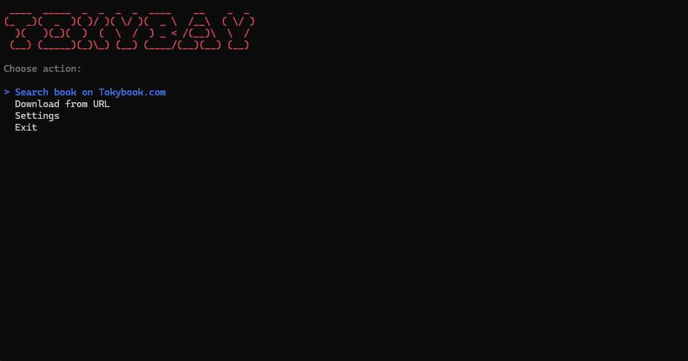

# TokyBay

Search & download audiobooks from multiple sites and convert them automatically to the audiobook-friendly M4B format or good old MP3.

> [!Important]
> Tokybook.com is currently undergoing a major platform overhaul and the website is temporarily closed. However, **TokyBay continues to work** — search and downloads still function via the Tokybook API.

> [!Note]
> This project is intended for educational purposes only. Please respect copyright laws and the terms of service of the respective websites.


## Table of Contents

- [Quick Start (No technical knowledge required)](#quick-start-no-technical-knowledge-required)
- [Supported Sites](#supported-sites)
- [Features](#features)
- [Usage](#usage)
- [For Developers](#for-developers)
- [License](#license)
- [Credits](#credits)



---

## Quick Start (No technical knowledge required)

No programming knowledge needed. No installation. Just download and run.

### Step 1 — Download TokyBay

Go to the **[latest release page](https://github.com/z00mable/TokyBay/releases/latest)** and download the file for your operating system:

| Your system | File to download |
|-------------|-----------------|
| Windows | `tokybay-win-x64.zip` |
| Linux (64-bit) | `tokybay-linux-x64.zip` |
| Linux (ARM, e.g. Raspberry Pi) | `tokybay-linux-arm64.zip` |
| macOS (Intel) | `tokybay-osx-x64.zip` |
| macOS (Apple Silicon M1/M2/M3) | `tokybay-osx-arm64.zip` |

### Step 2 — Extract the ZIP

Extract the downloaded ZIP file to any folder you like (e.g. your Desktop or Downloads folder).

### Step 3 — Run TokyBay

- **Windows:** Double-click `tokybay.exe` — or right-click it and select *Open in Terminal*
- **Linux / macOS:** Open a terminal in the extracted folder and run `./tokybay`

> [!Note]
> On macOS you may need to allow the binary in *System Settings → Privacy & Security* on first launch.

That's it. TokyBay will guide you through the rest.

> [!Note]
> On first start, TokyBay will automatically download [FFmpeg](https://github.com/FFmpeg/FFmpeg) — the tool it uses to convert audio files. This happens once and requires an internet connection.

---

## Supported Sites

*Last checked: 2026-04-08*

| Site | Status |
|------|--------|
| [audioaz.com](https://audioaz.com) | 🟢 Working |
| [audiozaic.com](https://audiozaic.com) | 🟢 Working |
| [bigaudiobooks.net](https://bigaudiobooks.net) | 🟢 Working |
| [bookaudiobook.net](https://bookaudiobook.net) | 🟢 Working |
| [findaudiobook.com](https://findaudiobook.com) | 🟢 Working |
| [freeaudiobooks.top](https://freeaudiobooks.top) | 🔴 Currently unreachable |
| [fulllengthaudiobooks.net](https://fulllengthaudiobooks.net) | 🟢 Working |
| [goldenaudiobook.net](https://goldenaudiobook.net) | 🟢 Working |
| [hdaudiobooks.net](https://hdaudiobooks.net) | 🟢 Working |
| [hotaudiobooks.com](https://hotaudiobooks.com) | 🟢 Working |
| [tokybook.com](https://tokybook.com) | 🔴 Website temporarily offline, 🟢 API operational |
| [zaudiobooks.com](https://zaudiobooks.com) | 🔴 Currently unreachable |

## Features

1. **Search**: Search and find audiobooks by title on Tokybook.com
2. **Direct URL download**: Download any audiobook directly by URL on supported sites
3. **M4B conversion**: Automatically convert to the M4B audiobook format after download
4. **MP3 conversion**: Automatically convert to MP3 format after download
5. **Multi-site support**: Works with Tokybook and many other sites
6. **Settings**: Persistent in-app settings — download path, conversion preferences

## Usage

### Search

1. Select **Search** from the main menu
2. Enter your search query
3. Select the desired book from the results
4. TokyBay automatically downloads and converts all chapters

### Direct URL Download

1. Select **Download from URL** from the main menu
2. Paste the audiobook URL (any supported site)
3. TokyBay automatically downloads and converts all chapters

### Settings

- Change the download path
- Toggle automatic M4B conversion
- Toggle automatic MP3 conversion
- Change the FFmpeg binary path

> [!Tip]
> By default, TokyBay downloads to your **Music** folder on Windows (`C:\Users\<User>\Music`) or your **home directory** on Linux/macOS. You can change this inside the app's settings, or pass a custom path via `-d "C:\Path\To\Downloads"` when launching from the terminal.

---

## For Developers

<details>
<summary>Build from source</summary>

### Prerequisites

- [.NET 10 SDK](https://dotnet.microsoft.com/download/dotnet/10.0)

### Clone and run

```sh
git clone https://github.com/z00mable/TokyBay.git
cd TokyBay
dotnet restore
dotnet build
dotnet run --project TokyBay -- -d "C:\Users\User\Music"
```

### Publish self-contained binaries

```sh
dotnet publish -c Release -r win-x64 --self-contained
dotnet publish -c Release -r linux-x64 --self-contained
dotnet publish -c Release -r linux-arm64 --self-contained
dotnet publish -c Release -r osx-x64 --self-contained
dotnet publish -c Release -r osx-arm64 --self-contained
```

### Adding a new site

1. Create a new class in `TokyBay/Scraper/Strategies/` extending `BaseScraperStrategy`
2. Implement `CanHandle(string url)` — URL-based detection
3. Implement `DownloadBookAsync(string url)` — fetch metadata, then call `ProcessTracksInParallelAsync`
4. Register it in `ScraperServiceExtensions.cs`:
   ```csharp
   services.AddTransient<IScraperStrategy, YourNewStrategy>();
   ```

</details>

---

## License

FFmpeg is mainly LGPL-licensed with optional components licensed under GPL. See the [FFmpeg license](https://ffmpeg.org/legal.html) for details.

Xabe.FFmpeg is licensed under [CC BY-NC-SA 3.0](https://creativecommons.org/licenses/by-nc-sa/3.0/) for non-commercial use. For commercial use, see [Xabe.FFmpeg licensing](https://ffmpeg.xabe.net/license.html).

## Credits

Inspired by:

- [castdrian/audiosnatch](https://github.com/castdrian/audiosnatch) — Adrian Castro
- [rahaaatul/TokySnatcher](https://github.com/rahaaatul/TokySnatcher) — Rahatul Ghazi
- [nazdridoy/audiobooksnatcher](https://github.com/nazdridoy/audiobooksnatcher) — nazDridoy
- [aviiciii/audiobook-downloader](https://github.com/aviiciii/audiobook-downloader) — aviiciii
